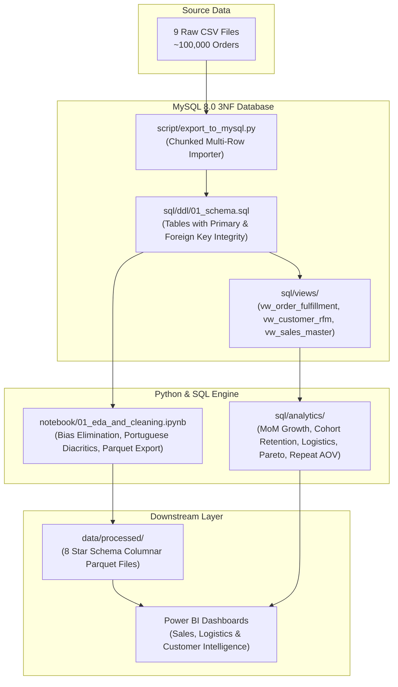

# 📊 Brazilian E-Commerce (Olist) Sales & Customer Intelligence Platform

[](https://www.python.org/)
[](https://www.mysql.com/)
[](https://github.com/astral-sh/uv)
[-brightgreen.svg)]()
[](https://github.com/ShaikhHamza104/brazilian-ecommerce-analytics/actions/workflows/ci.yml)
[]()

> **Data:** September 4, 2016 to October 17, 2018 (~100,000 orders / 99,441 records) | **Currency:** Brazilian Reais (R$)  
> **Author:** Mohd Hamza Shaikh  
> **Target Domain:** Data Analyst  

---

## 📌 Key Findings

- **Marketplace Scale & Black Friday Peak:** Analyzed 99,441 orders spanning September 2016 through October 2018 (generating R$ 13.59M in merchandise GMV, or R$ 15.74M including freight). Monthly order volume surged to a peak of 7,421 non-canceled orders (R$ 1.17M GMV) during the November 2017 Black Friday event (+53.3% MoM growth).
- **Repeat Buyer Economics vs. AOV:** Across non-canceled orders, repeat customers represented 3.06% of unique buyers (2,924 of 95,560) and 5.69% of total revenue (R$ 894,841.92). Their Average Order Value (AOV) was **R$ 144.80**, slightly lower than one-time buyers (**R$ 160.23**). Their cumulative spend was naturally higher (**R$ 306.03** vs. **R$ 160.23**) purely because they accumulated purchases across an average of 2.11 orders.
- **"Leaky Bucket" Cohort Retention:** Month 1 customer retention remained below 0.60% across all monthly cohorts (averaging ~0.45%), indicating a transactional marketplace driven by one-off customer acquisition rather than recurring habitual purchases.
- **Logistics Disparity ("The Two Brazils"):** Delivery transit times averaged 8.7 days in São Paulo (`SP`) with a 5.89% delay rate and R$ 17.33 average freight. In contrast, northern states like Roraima (`RR`) averaged 29.3 days in transit with R$ 48.34 average freight (~2.8× higher), where shipping consumed over 32% of total order value.
- **Merchant Concentration:** Seller revenue roughly follows a Pareto pattern: the top 17.65% of merchants (544 sellers) drove 79.83% of total platform GMV (R$ 10.85M), while the top 20% of sellers (619 merchants) generated 82.69% of GMV.

---

## 📖 Table of Contents
- [Project Overview & Origin](#-project-overview--origin)
- [Key Findings](#-key-findings)
- [Data Limitations](#-data-period--limitations)
- [Advanced Data Integrity & Edge-Case Preservations](#-advanced-data-integrity--edge-case-preservations)
- [Architectural Pipeline & Star Schema](#-architectural-pipeline--star-schema)
- [Analytical SQL Layer](#-analytical-sql-layer)
  - [Analytical Database Views (`sql/views/`)](#1-analytical-database-views-sqlviews)
  - [Deep-Dive Business Queries (`sql/analytics/`)](#2-deep-dive-business-queries-sqlanalytics)
- [Detailed Business Discoveries](#-detailed-business-discoveries)
- [Repository Structure](#-repository-structure)
- [Testing & Quality Assurance](#-testing--quality-assurance)
- [Installation & Quick Start](#-installation--quick-start)
- [Roadmap & Next Steps](#-roadmap--next-steps)
- [Author & Acknowledgments](#-author--acknowledgments)

---

## 🎯 Project Overview & Origin

This project originated as part of **Project 2 (E-Commerce Sales Analysis)** in the **Data Analytics Mentorship Program (DAMP 1.0 by CampusX)**. The curriculum established a strong core foundation across the end-to-end data lifecycle:
* Extracting transactional e-commerce data from relational databases using SQL.
* Preprocessing, cleaning, and transforming complex datasets using Python.
* Loading transformed tables into an analytical data warehouse structure.
* Creating interactive Power BI dashboards for sales analysis and executive decision-making.

### Where the Classroom Ends, Applied Analysis Begins
While standard course projects often conclude after basic descriptive statistics and initial charts, **I expanded this project into a modular, tested analytics pipeline**.

In commercial environments, an impactful Data Analyst must understand the operational context behind the numbers. Real-world transactional datasets contain subtle domain nuances: in-flight orders, customer account tokens versus individual shoppers, geographic logistics divides, and platform merchant risks.

I expanded this project across five analytical dimensions:
1. **Critical Edge-Case Auditing:** Investigated real-world domain nuances that standard pipelines overlook, successfully preserving **2,965 non-delivered operational order records**, **23,000+ early-delivery items**, and **2,924 repeat buyers (R$ 895K in revenue)**.
2. **Modular Analytics Engineering:** Refactored one-off scripts into an installable Python package (`src/e_commerce_sales_analysis`) with connection pooling, automated chunked ingestion, Portuguese text normalization (`unidecode`), and a 23-test automated test suite (`pytest`) with CI integration.
3. **Advanced SQL Analytical Views & Queries (MySQL 8.0):** Engineered analytical views and standalone analytics scripts leveraging **Common Table Expressions (CTEs)**, **Window Functions (`ROW_NUMBER()`, `SUM() OVER ()`, `LAG()`)**, and conditional classification (`CASE WHEN`).
4. **Customer & Merchant Diagnostics:** Built 6-month monthly cohort retention matrices, mapped the regional logistics divide, and quantified seller revenue concentration across 3,095 active merchants.
5. **Columnar Star Schema for BI:** Transformed relational tables into an optimized dimensional model exported to columnar **Parquet** files (`dim_*` and `fact_*`), eliminating Cartesian join risks and preparing the data for reporting.

---

## ⚠️ Data Period & Limitations

- **Historical Sample Window:** The dataset spans September 4, 2016 through October 17, 2018 (99,441 total orders). It represents a historical marketplace sample rather than a live, full-company database.
- **Sparse & Incomplete Months:** 
  - **Late 2016:** September 2016 (4 orders), October 2016 (324 orders), and December 2016 (1 order) reflect the initial platform launch period, with November 2016 completely missing.
  - **Late 2018:** September 2018 (16 orders, none delivered) and October 2018 (4 canceled orders) represent the collection cutoff.
  - **Stable Comparison Window:** Time-series trends and Month-over-Month (MoM) growth calculations focus on the 20 consecutive complete months between **January 2017 and August 2018**.
- **Customer Acquisition Cost (CAC) Data Absence:** The dataset contains transaction, product, and delivery attributes, but does not track advertising spend, marketing channels, or CAC figures. Any discussion of CAC recovery represents an analytical hypothesis based on observable order frequency, not verified marketing cost records.
- **Repeat Purchase Truncation:** Because the observation window covers ~24 months, long-cycle repeat purchases (e.g., major furniture or appliances bought every few years) may be censored by the dataset boundary.

---

## 🔬 Advanced Data Integrity & Edge-Case Preservations

During the exploratory data analysis phase, I audited data cleaning assumptions to ensure the dataset accurately reflected operational reality:

| # | Domain Nuance & Edge Case | Standard / Baseline Handling | Modular Pipeline Solution & Value Preserved |
|---|---|---|---|
| **1** | **Customer Account vs. Unique Individual** | Using `customer_id` for both transactions and customer counting. | Differentiated `customer_id` (transaction token) from `customer_unique_id` (actual human buyer). Identified all **3,345 repeat purchase events** across **2,924 repeat buyers** (non-canceled orders), revealing that repeat buyers averaged **R$ 144.80** per order (AOV) and **R$ 306.03** in cumulative lifetime spend, compared to **R$ 160.23** for one-time buyers. |
| **2** | **In-Flight & Canceled Shipments** | Naive date subtraction (`delivery - purchase >= 0`), which inadvertently drops rows where delivery date is `NULL`. | Scoped date integrity validation conditionally to `delivered` status only. Preserved **2,965 in-flight and non-delivered orders**, retaining full operational visibility into order cancellations, processing lag, and active shipments. |
| **3** | **Early Carrier Fulfillment** | Filtering out items where `shipping_limit_date < delivery_date` under the assumption of an invalid sequence. | Recognized that packages delivered *before* the seller dispatch deadline represent exceptional logistics performance. Preserved **23,000+ line items**. |
| **4** | **Financial Granularity (Items vs. Payments)** | Merging payments (1:M) and order items (1:N) directly into a single flat denormalized table. | Preserved accounting integrity by designing a **Star Schema** with separate Fact tables for Items and Payments, preventing Cartesian join inflation that artificially doubles revenue (verified via order `03ecec245220b63fd7f68c1737ba99ba`). |

---

## 🏗️ Architectural Pipeline & Star Schema

### Data Flow Pipeline



### Relational Entity-Relationship Diagram (ERD)

The complete 9-table relational schema is verified with proper Crow's Foot cardinality and zero orphan tables. You can review the full visual schema diagram in [docs/diagrams/databaseschema.png](file:///d:/E-commerce%20Sales%20Analysis/docs/diagrams/databaseschema.png).

```
[olist_customers] (1) ──────────── (N) [olist_orders] (1) ─── (N) [olist_order_items] (N) ─── (1) [olist_products]
                                         │            (1) ─── (N) [olist_order_payments]            │ (N)
                                         │            (1) ─── (N) [olist_order_reviews]             │
                                         │                                                          ▼ (1)
                                   (Ref Lookup)                                     [product_category_name_translation]
                                [olist_geolocation]
```

### Processed Analytical Star Schema (`data/processed/`)
- **Dimension Tables:** `dim_customers.parquet`, `dim_products.parquet`, `dim_sellers.parquet`, `dim_orders.parquet`, `dim_order_reviews.parquet`
- **Fact Tables:** `fact_order_items.parquet` (Grain: 1 row per product sold), `fact_order_payments.parquet` (Grain: 1 row per payment installment)
- **Analytical Master:** `olist_master_cleaned.parquet` (Unified line-item dataset for quick feature analysis)

---

## 💻 Analytical SQL Layer

### 1. Analytical Database Views (`sql/views/`)
- **[`vw_order_fulfillment.sql`](file:///d:/E-commerce%20Sales%20Analysis/sql/views/vw_order_fulfillment.sql):** Computes actual vs. estimated delivery duration, delay variance, and on-time delivery classification.
- **[`vw_customer_rfm.sql`](file:///d:/E-commerce%20Sales%20Analysis/sql/views/vw_customer_rfm.sql):** Recency calculated against a fixed dataset snapshot date (`2018-10-18`, max purchase timestamp + 1 day), Frequency, and Monetary aggregation with loyalty tier tagging.
- **[`vw_sales_master.sql`](file:///d:/E-commerce%20Sales%20Analysis/sql/views/vw_sales_master.sql):** Unified line-item transaction view classifying routes (`Same State` vs. `Inter-State`) and joining seller/customer geography with review ratings.

### 2. Deep-Dive Business Queries (`sql/analytics/`)
- **[`01_monthly_revenue_growth_mom.sql`](file:///d:/E-commerce%20Sales%20Analysis/sql/analytics/01_monthly_revenue_growth_mom.sql):** Calculates Monthly GMV, order volume, Average Order Value (AOV), and Month-over-Month growth percentage via `LAG()`. Captures the November 2017 Black Friday revenue surge to **R$ 1.17M**.
- **[`02_customer_cohort_retention.sql`](file:///d:/E-commerce%20Sales%20Analysis/sql/analytics/02_customer_cohort_retention.sql):** Tracks monthly customer acquisition cohorts over a 6-month window to calculate customer retention rates.
- **[`03_freight_and_delivery_delays_by_state.sql`](file:///d:/E-commerce%20Sales%20Analysis/sql/analytics/03_freight_and_delivery_delays_by_state.sql):** Computes state-level logistics transit times, delay rates, freight-to-basket ratios, and average customer review scores.
- **[`04_seller_performance_and_concentration.sql`](file:///d:/E-commerce%20Sales%20Analysis/sql/analytics/04_seller_performance_and_concentration.sql):** Applies window functions (`SUM() OVER`) to segment merchants into Pareto Tiers, tracking revenue concentration and carrier dispatch speeds.
- **[`05_repeat_buyer_aov.sql`](file:///d:/E-commerce%20Sales%20Analysis/sql/analytics/05_repeat_buyer_aov.sql):** Recomputes order-level AOV vs. customer lifetime spend for one-time vs. repeat buyers, isolating repeat buyers' true share of total marketplace revenue.

---

## 📈 Detailed Business Discoveries

All metrics below are computed from the historical sample (September 2016 to October 2018).

### 1. Customer Loyalty & Repeat Buyer Economics
- **One-Time Shoppers (92,636 customers):** Placed 92,636 orders generating **R$ 14,842,825.60** (94.31% of revenue), with an Average Order Value (AOV) of **R$ 160.23**.
- **Repeat Buyers (2,924 customers):** Placed 6,180 orders generating **R$ 894,841.92** (5.69% of revenue), with an Average Order Value of **R$ 144.80** and an average cumulative lifetime spend of **R$ 306.03** across ~2.11 orders.
- **Framing Note:** While lifetime spend per customer was naturally higher for repeat buyers (+91.0%) due to placing multiple orders, their spend per individual order (AOV) was slightly lower (-9.6%) than one-time buyers. Repeat buyers generated 5.69% of total platform revenue.

### 2. The "Leaky Bucket" Cohort Retention Reality
- **Month 1 Retention:** Remained below **0.60% across all monthly cohorts** (averaging ~0.45%).
- **Business Hypothesis (CAC Recovery):** During this observation period, Olist functioned predominantly as an acquisition-driven marketplace for durable, infrequent categories (furniture, electronics, auto parts). Because customer repeat rates were negligible, business economics likely required Customer Acquisition Cost (CAC) to be recovered on the initial transaction, assuming paid acquisition was employed. *(Note: This dataset does not track marketing spend or CAC).*

### 3. Supply Chain Disparities: "The Two Brazils"
- **Fulfillment Speed:** São Paulo (`SP`) averaged an **8.7-day** delivery turnaround with a **5.89%** delay rate. In contrast, Roraima (`RR`) averaged **29.3 days** in transit with a **12.20%** delay rate.
- **The Freight Disparity:** Customers in northern states paid nearly **3× more in freight** (averaging R$ 48.34 in `RR` vs R$ 17.33 in `SP`), with shipping making up over **32% of total order cost**.
- **Customer Satisfaction Impact:** Alagoas (`AL`) experienced a **23.93% late delivery rate**, dragging customer review scores down to **3.85 / 5.0**.

### 4. Merchant Concentration (Pareto Distribution)
- **Top 18 Elite Sellers (0.58% of sellers):** Generated **19.81% of total GMV (R$ 2.69M)**, averaging **R$ 149,575/seller**.
- **Top 128 Core Sellers (4.14% of sellers):** Drove **49.75% of total GMV (R$ 6.76M)**.
- **Top 539 Sellers (17.42% of sellers):** Drove **79.83% of total GMV (R$ 10.85M)** — roughly following a Pareto pattern where ~17.4% of sellers drove ~80% of volume.
- **Overall Top 20% Concentration:** The top 20% of merchants (619 sellers) generated **82.69% of total GMV**.
- **Fulfillment Discipline:** Elite merchants maintained a late dispatch rate of **7.84%**, compared to **11.42%** among the 2,514 long-tail merchants.

---

## 📂 Repository Structure

```plaintext
brazilian-ecommerce-analytics/
├── .github/
│   └── workflows/
│       └── ci.yml             # GitHub Actions CI for flake8 & pytest
├── data/
│   ├── raw/                   # 9 original source CSV datasets (from Kaggle)
│   └── processed/             # 8 analytical Parquet files (Star Schema)
├── docs/
│   ├── diagrams/              # databaseschema.png (Verified Crow's Foot ERD)
│   ├── olist_data_dictionary.pdf
│   └── project_showcase_notion.md  # Detailed portfolio report
├── notebook/
│   └── 01_eda_and_cleaning.ipynb   # Documented cleaning, diagnostics & Parquet exports
├── script/
│   ├── database.py            # Database utility scripts
│   ├── dataclean.py           # Text cleaning utilities
│   └── export_to_mysql.py     # Multi-row batch CSV-to-MySQL ingestion CLI
├── sql/
│   ├── ddl/
│   │   └── 01_schema.sql      # 3NF relational schema DDL with PK/FK constraints
│   ├── views/
│   │   ├── vw_order_fulfillment.sql  # Delivery performance & delay classification
│   │   ├── vw_customer_rfm.sql        # Customer RFM metrics & loyalty tiers (fixed snapshot)
│   │   └── vw_sales_master.sql        # Denormalized line-item sales with route tagging
│   └── analytics/
│       ├── 01_monthly_revenue_growth_mom.sql       # MoM GMV, volume & Black Friday
│       ├── 02_customer_cohort_retention.sql         # 6-month retention matrix
│       ├── 03_freight_and_delivery_delays_by_state.sql # State logistics & review score
│       ├── 04_seller_performance_and_concentration.sql # Pareto merchant analysis
│       └── 05_repeat_buyer_aov.sql                 # Repeat buyer AOV & revenue share
├── src/e_commerce_sales_analysis/
│   ├── config.py              # Dynamic project root & settings
│   ├── db/
│   │   ├── connection.py      # SQLAlchemy connection pool with SSL & health-checks
│   │   └── loader.py          # Chunked database reader & query runner
│   └── cleaning/
│       ├── text.py            # unidecode Brazilian diacritic normalization
│       └── transforms.py      # Route, delivery delay, and loyalty classification
├── tests/                     # 23 automated tests (10 non-DB unit tests, 13 DB smoke tests)
├── .flake8                    # Flake8 linter configuration
├── pyproject.toml             # Project metadata & dependencies (uv managed)
└── README.md
```

---

## 🧪 Testing & Quality Assurance

The codebase includes an automated test suite executed via `pytest`. It consists of:
- **10 Unit Tests (No Database Required):** Validate Brazilian city string normalization, accent stripping, state suffix removal, route classification (`Same State` vs. `Inter-State`), delivery delay classification, customer loyalty segmentation, and input validation.
- **13 Database Smoke Tests (Marked `@pytest.mark.db`):** Validate live MySQL connectivity, environment credentials, and non-empty record counts across all 9 relational tables.

### Running Fast Unit Tests (Default / CI)
The default `pytest` configuration automatically runs only tests that do not require a live database:

```bash
uv run pytest
```

Output:
```plaintext
============================= test session starts =============================
platform win32 -- Python 3.11.16, pytest-9.1.1, pluggy-1.6.0
rootdir: D:\E-commerce Sales Analysis
configfile: pyproject.toml
collected 23 items / 13 deselected / 10 selected

tests\test_cleaning.py ........                                          [ 80%]
tests\test_database.py ..                                                [100%]

====================== 10 passed, 13 deselected in 2.11s ======================
```

### Running the Full Suite (With Live MySQL)
To run all tests including database integration checks:

```bash
uv run pytest -m "db or not db"
```

### Code Style & Linting
Run `flake8` across the codebase:

```bash
uv run flake8
```

---

## 🚀 Installation & Quick Start

### 0. Download Raw Data from Kaggle
Download the [Brazilian E-Commerce Public Dataset by Olist](https://www.kaggle.com/datasets/olistbr/brazilian-ecommerce) from Kaggle and place the 9 unzipped CSV files into `data/raw/`:
- `olist_customers_dataset.csv`
- `olist_geolocation_dataset.csv`
- `olist_order_items_dataset.csv`
- `olist_order_payments_dataset.csv`
- `olist_order_reviews_dataset.csv`
- `olist_orders_dataset.csv`
- `olist_products_dataset.csv`
- `olist_sellers_dataset.csv`
- `product_category_name_translation.csv`

### 1. Prerequisites
- **Python 3.11+**
- **MySQL Server 8.0+**
- [**uv**](https://github.com/astral-sh/uv) (recommended package manager)

### 2. Setup Environment
```bash
# Clone the repository
git clone https://github.com/ShaikhHamza104/brazilian-ecommerce-analytics.git
cd brazilian-ecommerce-analytics

# Create virtual environment and install dependencies via uv
uv sync
```

### 3. Configure Database
Create a `.env` file in the root directory (refer to `.env.sample`):
```ini
DB_USER=root
DB_PASSWORD=your_password
DB_HOST=localhost
DB_PORT=3306
DB_NAME=ecommerce_sales
```

Initialize the database schema:
```sql
CREATE DATABASE IF NOT EXISTS ecommerce_sales
CHARACTER SET utf8mb4 COLLATE utf8mb4_unicode_ci;
```

### 4. Ingest Raw Data into MySQL
Import the 9 CSV datasets into MySQL using the chunked ingestion CLI:
```bash
uv run python script/export_to_mysql.py
```

### 5. Generate Analytical Star Schema (Parquet)
Execute the data cleaning and star schema generation notebook to generate the 8 columnar Parquet tables in `data/processed/`:
```bash
uv run jupyter execute notebook/01_eda_and_cleaning.ipynb
```

This outputs:
- `dim_customers.parquet`
- `dim_products.parquet`
- `dim_sellers.parquet`
- `dim_orders.parquet`
- `dim_order_reviews.parquet`
- `fact_order_items.parquet`
- `fact_order_payments.parquet`
- `olist_master_cleaned.parquet`

### 6. Run Analytics Queries
Run any of the analytical queries directly in your SQL client or via Python:
```bash
# Example: Run Repeat Buyer AOV and Revenue Share Analysis
uv run python -c "
from e_commerce_sales_analysis.db.connection import get_engine
from sqlalchemy import text
import pandas as pd

engine = get_engine()
with open('sql/analytics/05_repeat_buyer_aov.sql', 'r') as f:
    df = pd.read_sql(text(f.read()), engine)
print(df.to_string(index=False))
"
```

---

## 🗺️ Roadmap & Next Steps

- [x] Initial relational schema DDL with primary and foreign key constraints.
- [x] Chunked multi-row CSV-to-MySQL data ingestion engine.
- [x] Exploratory data analysis, bias elimination, and Parquet export pipeline.
- [x] Automated test suite (23 tests: 10 unit tests, 13 DB smoke tests) with CI workflow.
- [x] Analytical SQL views (`vw_order_fulfillment`, `vw_customer_rfm`, `vw_sales_master`).
- [x] Deep-dive business SQL queries (MoM growth, cohort retention, logistics disparity, seller Pareto, repeat buyer AOV).
- [ ] Connect Power BI Desktop to the Parquet files for interactive executive reporting.

---

## 👤 Author & Acknowledgments

- **Author:** Mohd Hamza Shaikh ([kmohdhamza10@gmail.com](mailto:kmohdhamza10@gmail.com))
- **Role:** Data Analyst
- **Foundational Mentorship & Curriculum:** Special thanks to **Nitish Singh** and the **CampusX Data Analytics Mentorship Program (DAMP 1.0)** for providing the core foundational framework (Project 2: E-Commerce Sales Analysis) that inspired this modular analytics deep dive.
- **Dataset Source & License:** [Olist Brazilian E-Commerce Public Dataset on Kaggle](https://www.kaggle.com/datasets/olistbr/brazilian-ecommerce) by Olist, released under the **CC BY-NC-SA 4.0** (Creative Commons Attribution-NonCommercial-ShareAlike 4.0 International) license.
